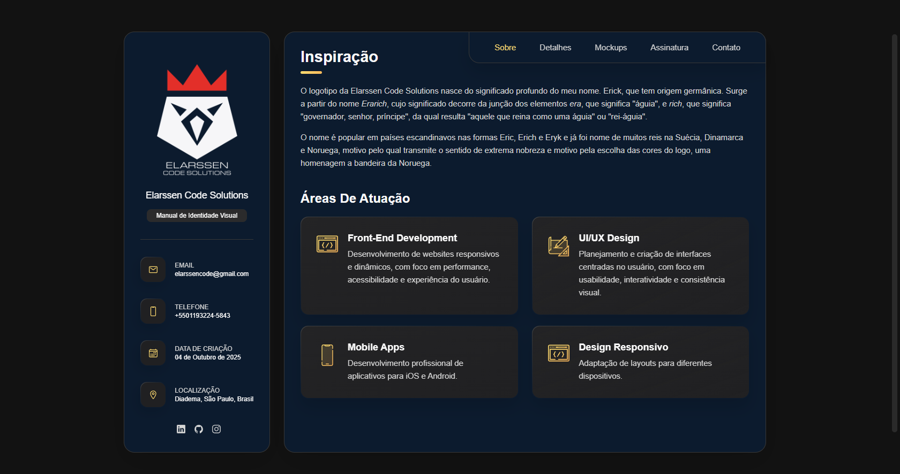

# 🎨 MIV – Elarssen Code Solutions



> Um Manual de Identidade Visual **interativo, responsivo e moderno**, criado para apresentar a identidade da marca **Elarssen Code Solutions** de forma elegante, funcional e digital, combinando design e código em uma experiência única.

---

## 🚀 **Visite o Projeto**
🔗 [Acesse o MIV Online](https://elarssen-code-solutions.netlify.app)

---

## 🧠 **Sobre o Projeto**
O **MIV – Elarssen Code Solutions** foi desenvolvido para transformar o tradicional manual de identidade visual em uma **plataforma web interativa**.

Todo o site foi construído com a filosofia **mobile-first**, garantindo que a experiência em smartphones e tablets fosse priorizada desde o início do desenvolvimento, e posteriormente expandida de forma fluida para telas maiores, exibindo:
- Paleta de cores com modais informativos  
- Aplicações corretas e incorretas do logotipo  
- Reduções, margens de segurança e variações de uso  
- Versões em tons de cinza e monocromáticas  
- Mockups de aplicação real em produtos e fachadas  
- Tipografia, grid e proporções  
- Responsividade completa para todos os dispositivos  

Cada seção foi pensada para garantir clareza, consistência visual e uma **experiência digital fluida** — refletindo o padrão de qualidade da marca.

---

## 🧩 **Tecnologias Utilizadas**

<div align="center">

| **Front-End** | **Design e Organização** | **Outros Recursos** |
|:--------------:|:-----------------------:|:-------------------:|
|  |  |  |
|  |  |  |
|  |  | 🌠Azure Static Web Apps |

</div>

---

## 📱 **Principais Recursos**
✅ Layout totalmente **responsivo**  
✅ Estrutura semântica em **HTML5**  
✅ Estilização moderna com **CSS3** (gradientes, sombras e transições)  
✅ Interatividade via **JavaScript puro**  
✅ Design adaptado à identidade **Elarssen Code Solutions**  
✅ Ícones SVG e integração com **Ionicons**  
✅ Seções dinâmicas de **Mockups e Filtros de Aplicação**  
✅ Scrollbar e efeitos visuais personalizados  

---

## ⚙️ **Como Rodar Localmente**
```bash
# Clone o repositório
git clone https://github.com/elarssen-design/miv-elarssen-code-solutions.git

# Entre na pasta do projeto
cd miv-elarssen-code-solutions

# Abra no VS Code
code .
